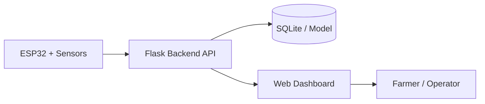

# SmartPlant

<p align="center">
	SmartPlant is a full-stack smart irrigation system for paddy fields, combining ESP32 hardware, a Flask backend, and a mobile-ready web dashboard to monitor crop conditions and support watering decisions.
</p>

<p align="center">
	<a href="https://smart-plant-r0me.onrender.com">
		
	</a>
	<a href="frontend/SETUP_GUIDE.md">
		
	</a>
	<a href="backend/hardware/HARDWARE_GUIDE.md">
		
	</a>
</p>

## Overview

SmartPlant is built to help growers monitor soil moisture, temperature, humidity, and irrigation status from a single dashboard. The ESP32 collects sensor data from the field, the backend stores and evaluates the readings, and the frontend presents a clean control surface for live monitoring, alerts, and pump actions.

## Key Features

| Feature | What it delivers |
| --- | --- |
| Real-time monitoring | Track moisture, temperature, humidity, and irrigation state as data is uploaded from the field. |
| Machine learning support | Use trained predictions to estimate irrigation need from current conditions. |
| Manual pump control | Trigger irrigation from the dashboard when immediate intervention is needed. |
| Multi-zone workflow | Organize and monitor different field sections independently. |
| Browser notifications | Receive alert updates through push notifications when enabled. |
| PWA support | Open the dashboard like an app on mobile devices and install it to the home screen. |

## How It Works

1. The ESP32 reads sensor data from the field and sends it to the backend API.
2. The Flask backend stores the readings, applies irrigation logic, and serves app data.
3. The web dashboard displays live metrics, alerts, prediction results, and pump controls.



## Tech Stack

| Layer | Tools |
| --- | --- |
| Backend | Flask, SQLite, Pandas, scikit-learn, JWT, Web Push |
| Frontend | HTML, CSS, JavaScript, Tailwind CSS, PWA |
| Hardware | ESP32, soil moisture sensor, DHT sensor, relay / pump |

## Project Structure

```text
smartplant_paddy/
├─ backend/
│  ├─ app.py
│  ├─ train_generated_model.py
│  ├─ irrigation_prediction.csv
│  └─ hardware/
│     ├─ HARDWARE_GUIDE.md
│     └─ smartplant_oled_esp32.ino
├─ frontend/
│  ├─ index.html
│  ├─ package.json
│  ├─ manifest.json
│  ├─ sw.js
│  └─ SETUP_GUIDE.md
├─ render.yaml
├─ README.md
└─ Smart_Plant.ino
```

## Quick Start

### Backend

```bash
cd backend
pip install -r requirements.txt
python app.py
```

By default, the backend runs on `http://localhost:5000` in local development.

### Frontend

Open `frontend/index.html` directly in your browser or serve the `frontend` folder with any static server.

### Hardware

Use the ESP32 firmware in `Smart_Plant.ino` or the hardware guide under `backend/hardware/` to connect your sensors, relay, and network settings.

## Deployment

### Backend on Render

- Use [render.yaml](render.yaml) as the Render service configuration.
- Set the required environment variables for JWT, ESP device access, and VAPID push keys.

### Frontend Hosting

- The frontend is a static web app and can be deployed to Netlify, Render static hosting, or any static host.
- If your backend URL changes, update the API base in [frontend/index.html](frontend/index.html).

## Hardware Notes

- The system is designed around an ESP32 controller with sensor input and relay-based pump control.
- The hardware guide includes API payload examples, firmware integration notes, and safety checks.
- Push notifications require valid VAPID keys on the backend.

## Documentation

- [Frontend setup guide](frontend/SETUP_GUIDE.md)
- [Hardware integration guide](backend/hardware/HARDWARE_GUIDE.md)

## Notes

- SQLite is used for local persistence.
- The backend and frontend are intended to communicate over HTTPS in production.
- The live demo is deployed on Render and linked above for quick access.