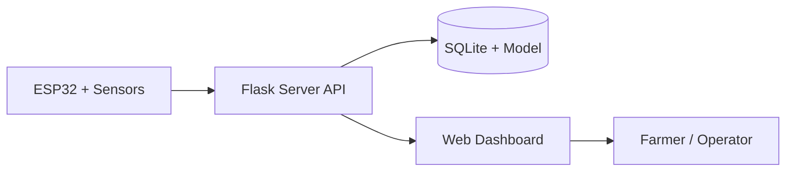

# SmartPlant

<p align="center">
  SmartPlant is a smart irrigation platform for paddy fields, combining ESP32 hardware, a Flask server, and a web dashboard for real-time monitoring and pump control.
</p>

<p align="center">
  <a href="https://smart-plant-r0me.onrender.com">
    
  </a>
</p>

<p align="center">
  <a href="client/SETUP_GUIDE.md">
    
  </a>
  <a href="server/hardware/HARDWARE_GUIDE.md">
    
  </a>
</p>

## Overview

SmartPlant helps growers monitor soil moisture, temperature, humidity, and irrigation status from a single dashboard. Sensor readings are collected by the ESP32, processed by the server, and displayed in the web interface for quick action.

## Features

| Feature | What it does |
| --- | --- |
| Real-time monitoring | Shows soil moisture, temperature, humidity, and irrigation status. |
| Irrigation prediction | Uses machine learning to estimate watering need. |
| Manual pump control | Lets the user start irrigation from the dashboard. |
| Browser notifications | Sends alerts for important updates. |
| PWA support | Makes the dashboard feel like an installable app on mobile. |

## How It Works

1. The ESP32 reads sensor data from the field and sends it to the server API.
2. The server stores the readings, applies irrigation logic, and serves app data.
3. The dashboard shows live values, alerts, and controls for monitoring and action.



## Tech Stack

| Layer | Tools |
| --- | --- |
| Server | Flask, SQLite, Pandas, scikit-learn, JWT, Web Push |
| Client | HTML, CSS, JavaScript, Tailwind CSS, PWA |
| Hardware | ESP32, soil moisture sensor, DHT sensor, relay / pump |

## Quick Start

### Server

```bash
cd server
pip install -r requirements.txt
python app.py
```

The server runs locally at `http://localhost:5000` during development.

### Client

Open `client/index.html` in your browser or serve the `client` folder with any static file server.

### Hardware

Use `Smart_Plant.ino` or the hardware guide in `server/hardware/` to connect the ESP32, sensors, and relay.

## Deployment

- Use [render.yaml](render.yaml) for the server service on Render.
- Set the required environment variables for JWT, ESP device access, and VAPID push keys.
- If the server URL changes, update the API base in [client/index.html](client/index.html).

## Documentation

- [Client setup guide](client/SETUP_GUIDE.md)
- [Server hardware guide](server/hardware/HARDWARE_GUIDE.md)

## Notes

- SQLite is used for local storage.
- Push notifications require valid VAPID keys.
- Production communication should use HTTPS.
